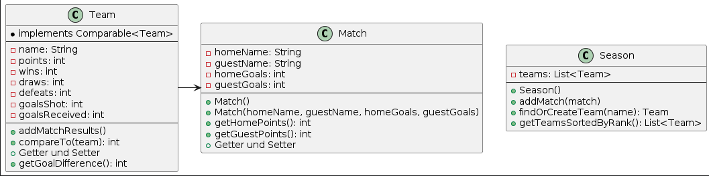
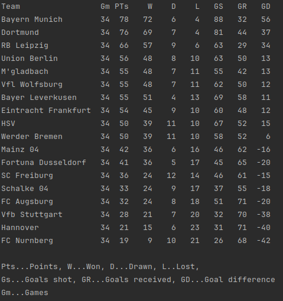

# 2AHITM - SEW - Testvorbereitung 2 - 2024-04-23

## Themenschwerpunkte
* Sortieralgorithmus
* Comparable

## 1. Ausgangssituation
* Sie erhalten die Aufgabe zur erstellung einer Tabelle der deutschen Fußballliga



## 2. Aufgabenstellung
* Erstellen sie alle Klassen anhand des Klassendiagramms.
* Zum einlesen der Csv Datei exestiert eine bereits erstelle Klasse es muss nur der Pfad in der Main-Klasse eingegeben werden
* Die Ausgabe ist schon vorgefertigt in der Main
* Zum Sortieren wird der Insertionsort verwendet


## 3. Ausgabe


## 4. Verbesserung der README.md
* Bei der Methode addMatchResults sollten die Parameter int points, int goalsShot, int goalsReceived mit gegeben werden.
* Bei compareTo() vergleicht das Team mit einer anderen Mannschaft
  Die Mannschaft mit der größeren Punktezahl liegt voran.
  Bei Punktegleichheit liegt die Mannschaft mit dem besseren Torverhältnis voran.
  Falls auch das Torverhältnis gleich ist, liegt die Mannschaft mit der größeren Anzahl an geschossenen Toren voran.
* Kein Standard Konstruktor bei Match Klasse
* 

#
> **Tip:** Falls es Fragen gibt schreib mir.
#


````
____   ____.__       .__      _________                          ._.
\   \ /   /|__| ____ |  |    /   _____/__________    ______ _____| |
 \   Y   / |  |/ __ \|  |    \_____  \\____ \__  \  /  ___//  ___/ |
  \     /  |  \  ___/|  |__  /        \  |_> > __ \_\___ \ \___ \ \|
   \___/   |__|\___  >____/ /_______  /   __(____  /____  >____  >__
                   \/               \/|__|       \/     \/     \/ \/
````
